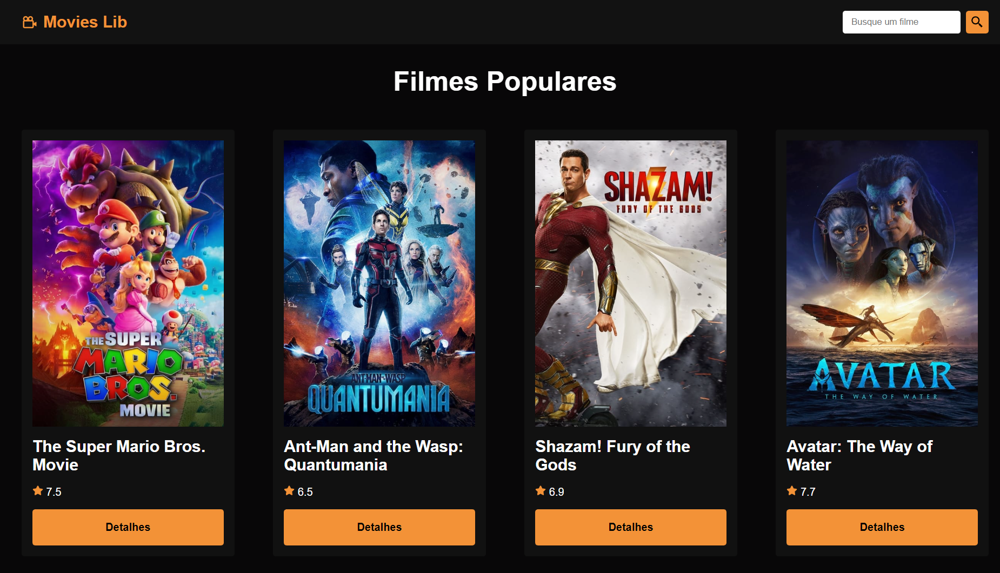
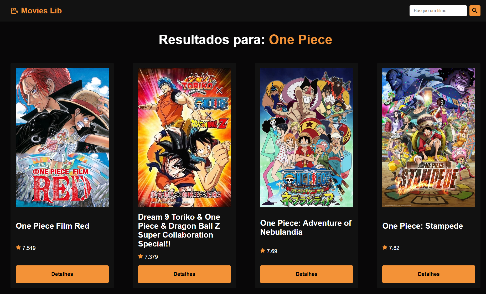
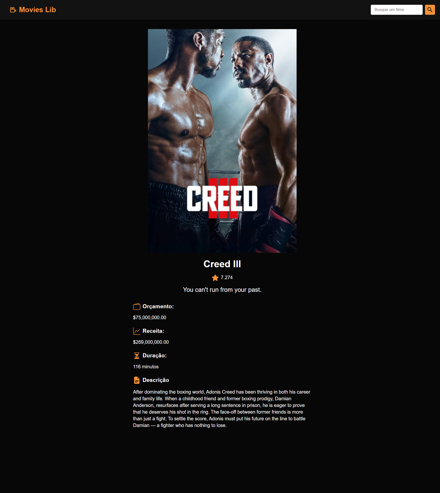

<h1 align="center"> Movie Lib TMDB </h1>

  <a href="#-about">About</a>&nbsp;&nbsp;&nbsp;|&nbsp;&nbsp;&nbsp;
  <a href="#-preview">Preview</a>&nbsp;&nbsp;&nbsp;|&nbsp;&nbsp;&nbsp;
  <a href="#-tecnologies">Tecnologies</a>&nbsp;&nbsp;&nbsp;|&nbsp;&nbsp;&nbsp;
  <a href="#-links">Links</a>&nbsp;&nbsp;&nbsp;|&nbsp;&nbsp;&nbsp;

  

 

## 🧾 About

Project made together with Matheus Battist, aiming at practicing React and API.

## 🔎 Preview

  

  

  

## 🚀 Tecnologies

This project was developed with the following technologies:

- ReactJs
- SASS

## 🧾 Links

Go to the project [HERE](https://tmdbmovielib.vercel.app).

---
